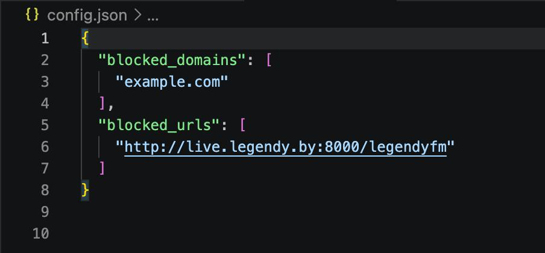
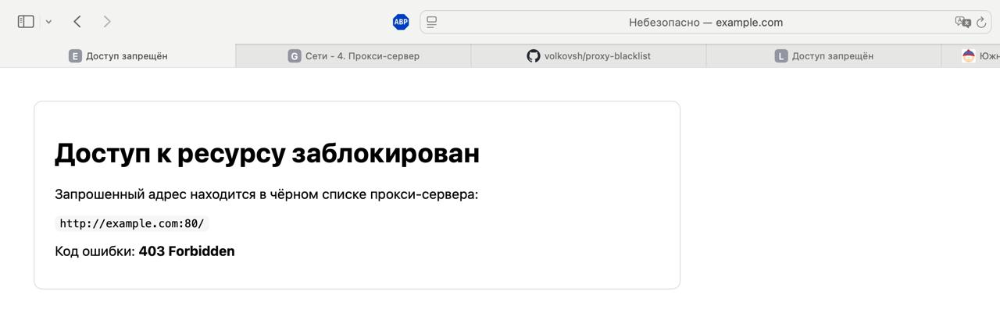
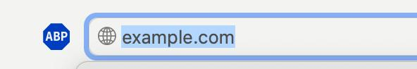
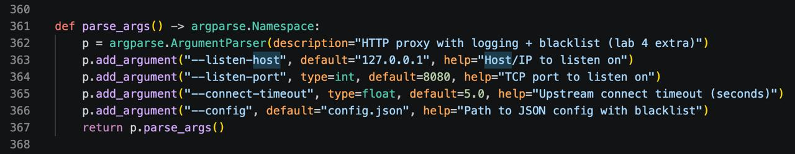
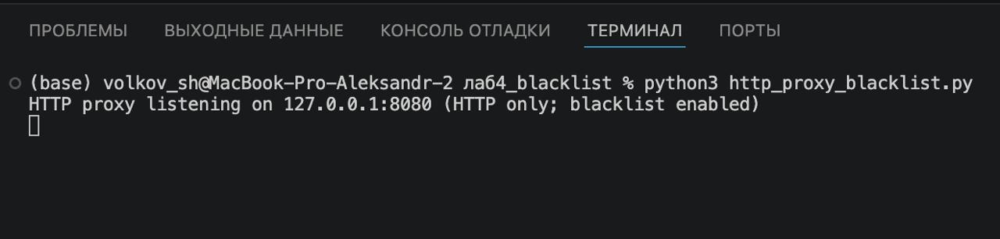
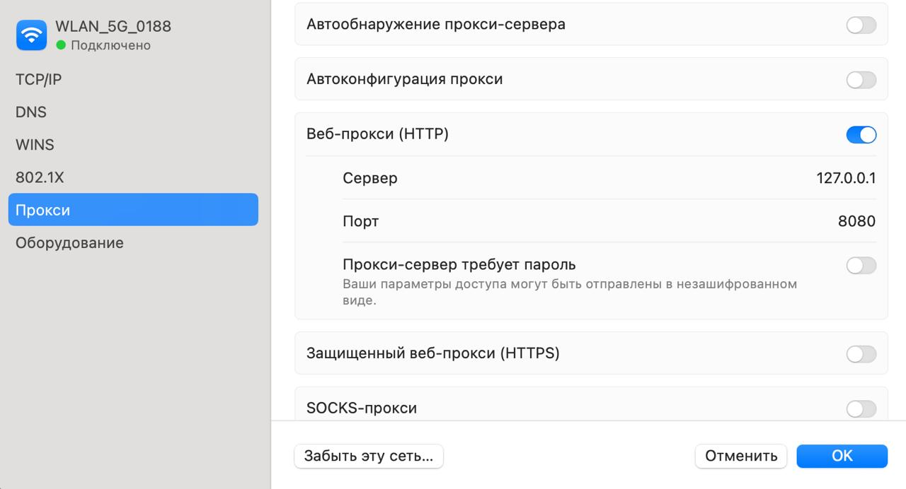
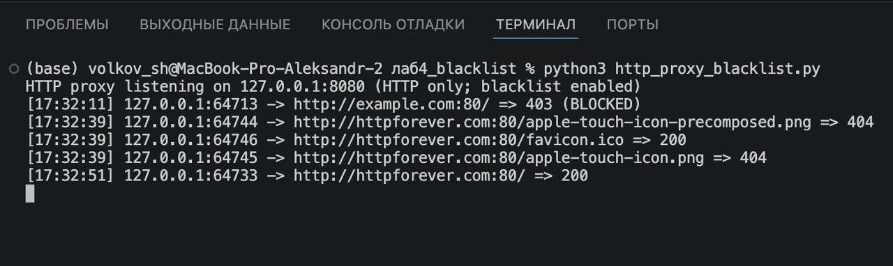
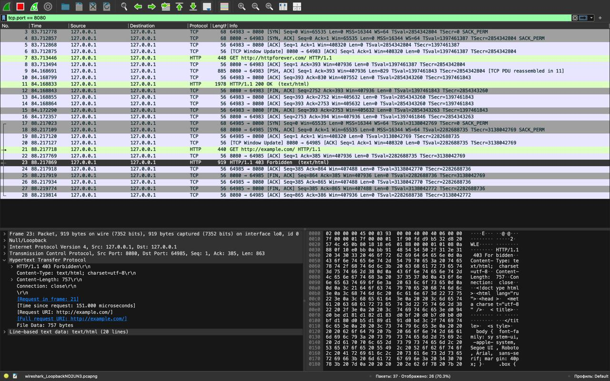

# Министерство образования
Учреждение образования
«Белорусский государственный университет информатики и
радиоэлектроники»

Специальность «Программная инженерия»
Кафедра программного обеспечения информационных технологий
Учебная дисциплина «Компьютерные системы и сети»

## ОТЧЁТ
по лабораторной работе №4
«HTTP прокси-сервер с журналированием и чёрным списком»

**Выполнил:** Волков А. С.

**Проверила:** Болтак С. В.

Минск 2026

---

## Цель работы

Реализовать простой HTTP прокси‑сервер на Socket API с многопоточностью и журналированием проксируемых запросов (URL и код ответа). Реализовать фильтрацию по чёрному списку доменов и/или URL с возвратом страницы блокировки.

---

## Поддерживаемый протокол

Прокси обрабатывает HTTP‑запросы. При получении запроса `CONNECT` возвращается `501 Not Implemented`.

---

## Особенность URI в запросах к прокси (absolute-form → origin-form)

При работе через прокси браузер отправляет request-line в виде полного URL (absolute-form), например:

`GET http://live.legendy.by:8000/legendyfm HTTP/1.1`

Однако сервер назначения часто ожидает запрос в виде пути (origin-form):

`GET /legendyfm HTTP/1.1`

Прокси парсит URL, выделяет `host:port` и `path`, и при пересылке upstream переписывает request-line в origin-form.

---

## Чёрный список (дополнительное задание)

Чёрный список задаётся в `config.json`:

- `blocked_domains` — домены для блокировки (точно или по суффиксу), например `example.com`.
- `blocked_urls` — URL для блокировки по префиксу, например `http://live.legendy.by:8000/legendyfm`.

**Рисунок 1 – конфигурация чёрного списка (`config.json`)**

При попадании адреса под правила прокси возвращает `HTTP/1.1 403 Forbidden` и HTML‑страницу с сообщением об ошибке.

**Рисунок 2 – страница блокировки (пример)**

**Рисунок 3 – адрес в строке поиска (проверка URL)**

---

## Многопоточность и потоковая прокачка данных

Прокси принимает входящие TCP‑соединения и обрабатывает каждого клиента в отдельном потоке (`threading.Thread(..., daemon=True)`).

Ответ от сервера назначения проксируется **потоково** (без накопления целиком в памяти) — важно для длинных ответов/стриминга (например, онлайн‑радио).

Для упрощения обработки ответа при пересылке upstream добавляется заголовок `Connection: close`, поэтому прокси читает ответ до закрытия соединения сервером назначения.

---

## Журналирование (URL и код ответа)

После получения заголовков ответа прокси извлекает код статуса (например, `200`, `404`) и выводит в консоль строку вида:

`[HH:MM:SS] <client_ip>:<client_port> -> <absolute_url> => <status_code>`

При блокировке по чёрному списку лог помечается как:

`=> 403 (BLOCKED)`

---

## Запуск и настройка браузера

### Команда запуска

    python3 http_proxy_blacklist.py --listen-host 127.0.0.1 --listen-port 8080 --config config.json

### Настройка прокси в браузере

В браузере включается ручной прокси только для HTTP:

- HTTP proxy: `127.0.0.1`
- Port: `8080`

**Рисунок 4 – настройка HTTP proxy в браузере**

---

## Тестирование

### Запуск прокси

**Рисунок 5 – запуск прокси‑сервера**

### Подключение клиента

**Рисунок 6 – подключение клиента к прокси**

### Проверочные запросы

Для проверки выполнены запросы через настроенный прокси:

- `http://example.com/` — пример HTTP‑страницы
- `http://live.legendy.by:8000/legendyfm` — потоковый ресурс (онлайн‑радио)

Также проверена блокировка по чёрному списку (возврат 403 и страницы блокировки).

**Рисунок 7 – журнал проксируемых запросов (URL и код ответа)**

---

## Анализ трафика (Wireshark)

**Рисунок 8 – трафик в Wireshark (en0)**

**Рисунок 9 – трафик в Wireshark (lo0)**

---

## Вывод

Реализован многопоточный HTTP прокси‑сервер на Socket API с журналированием URL и кодов ответа. Выполнено преобразование request-line из absolute-form в origin-form при пересылке на сервер назначения. Реализована фильтрация по чёрному списку доменов и URL с возвратом страницы блокировки и кода `403 Forbidden`.

